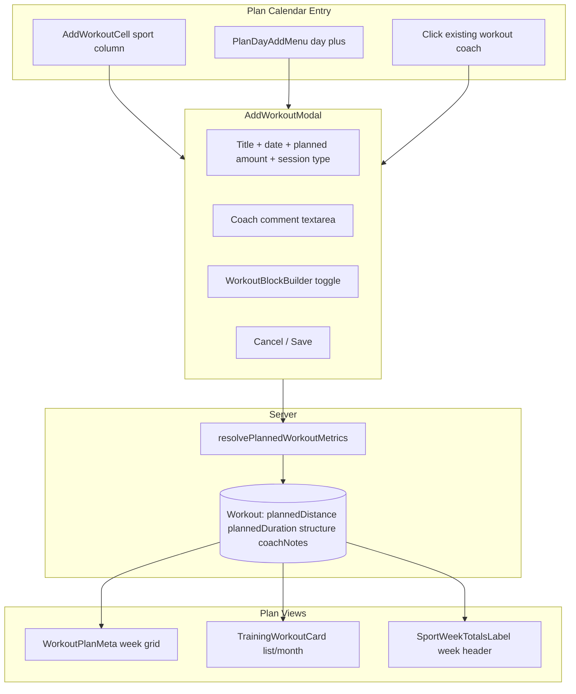

# RUN & BIKE Workout Add/Edit — Current Behavior Spec

This document describes **exactly how the app works today** for coach and athlete flows when adding or editing **Run** and **Bike** workouts from the training plan. Use it to spot UX gaps, inconsistencies, and improvement opportunities.

---

## 1. High-Level Architecture



**Key files:**

- Modal: [`src/components/plan/add-workout-modal.tsx`](src/components/plan/add-workout-modal.tsx)
- Modal builder: [`src/components/plan/workout-block-builder.tsx`](src/components/plan/workout-block-builder.tsx)
- Segment/interval UI: [`src/components/workout-builder/builder-segment-editor.tsx`](src/components/workout-builder/builder-segment-editor.tsx)
- Estimation: [`src/lib/workout-builder/segment-estimation.ts`](src/lib/workout-builder/segment-estimation.ts)
- Save actions: [`src/app/actions/workout-builder.ts`](src/app/actions/workout-builder.ts)
- Plan display: [`src/components/plan/workout-plan-meta.tsx`](src/components/plan/workout-plan-meta.tsx), [`src/lib/plan-week-totals.ts`](src/lib/plan-week-totals.ts)

---

## 2. Entry Points (How You Open the Modal)

### 2.1 Coach — sport column cell (`AddWorkoutCell`)

**File:** [`src/components/plan/add-workout-cell.tsx`](src/components/plan/add-workout-cell.tsx)

| Cell state            | UI                                  |
| --------------------- | ----------------------------------- |
| Empty RUN/BIKE column | Large **+** button                  |
| Has workouts          | Workout list + small **Add** button |
| Athlete, empty        | Nothing rendered                    |
| Athlete, has workouts | Read-only list only                 |

**Modal opens with:**

- `date` = that day
- `sport` = column sport (**locked** — no sport picker inside modal)
- No `workout` → **create** mode

Coach can **drag workouts** between same-sport cells on different days when drag is enabled.

### 2.2 Coach — day-level menu (`PlanDayAddMenu`)

**File:** [`src/components/plan/plan-day-add-menu.tsx`](src/components/plan/plan-day-add-menu.tsx)

Day **+** menu lists all sports (RUN, BIKE, SWIM, etc.). Choosing RUN or BIKE opens the same modal with `sport` locked.

Also offers: **Note**, **Recovery day**.

### 2.3 Coach — edit existing workout

**File:** [`src/components/plan/workout-detail-modal.tsx`](src/components/plan/workout-detail-modal.tsx)

When coach clicks a planned RUN/BIKE workout, `WorkoutDetailModal` **does not show a read-only view** — it immediately renders `AddWorkoutModal` with:

- `workout={existing}`
- `sport={workout.type}` (locked)

Delete action appears in modal header (top-right, next to X).

### 2.4 Athlete — day menu only

Athlete opens `AddWorkoutModal` with `athleteMode={true}`:

- **No sport locked** — sport picker shown inside modal
- **No builder**, no templates, no coach notes
- Only simple session types
- Saves with `selfLogged: true` → **"Self-added"** badge on plan

Athletes **cannot** add from empty sport cells.

---

## 3. Modal Shell & UX Rules

**File:** [`src/components/plan/add-workout-modal.tsx`](src/components/plan/add-workout-modal.tsx)

| Rule           | Detail                                                                           |
| -------------- | -------------------------------------------------------------------------------- |
| Width          | `max-w-lg` normally; **`max-w-3xl`** when builder open                           |
| Dismiss        | **Cannot** close via outside click, overlay click, or **Escape**                 |
| Close only via | **X**, **Cancel**, **Save** (success), **Exit workout builder** (stays in modal) |
| Remount        | Form resets when `workout.id`, `date`, `sport`, or `athleteMode` changes         |

### Corner actions (absolute top-right)

| Mode         | Action                                                      |
| ------------ | ----------------------------------------------------------- |
| Coach create | Template picker (folder icon) — only if coach has templates |
| Coach edit   | Delete workout button                                       |
| Athlete      | Neither                                                     |

---

## 4. Modal Header Layout

```
[Sport icon]  [Editable title — text-lg, bold, no underline]
              [Date subtitle]
              [Planned amount · Session type]
```

### 4.1 Title

- Auto-focus on open
- Placeholder = auto title, e.g. **"Run · Easy Run"** or **"Bike · Easy"**
- Auto-updates when session/sport changes **unless** user manually edited title
- Source: [`defaultWorkoutTitle()`](src/lib/workout-builder/default-structure.ts)

### 4.2 Planned amount (combined distance OR time)

**Single field** — not two separate inputs.

| Part            | Behavior                                                                            |
| --------------- | ----------------------------------------------------------------------------------- |
| Numeric input   | Center-aligned, bold, **underline** on input only                                   |
| Unit suffix     | Dropdown: **km** (default) or **min** — no underline on dropdown                    |
| Default mode    | **distance (km)** for RUN/BIKE                                                      |
| Switch to time  | User picks **min** from suffix dropdown                                             |
| Predicted label | Lighter text beside field: `(~58 min)` when in km mode, `(~12 km)` when in min mode |

**Prediction sources (in order):**

1. If builder has blocks → structure estimates (`estimateStructureDistanceKm` / `estimateStructureDurationMinutes`)
2. Else if user entered a value → convert using athlete **easy pace** from profile (or fallback ~5:45/km)

**Auto-fill from builder:**

- When structure changes, **both** `plannedDistance` and `plannedDuration` state update internally
- UI shows only the **active mode** value
- Auto-fill skipped if user manually edited amount (`amountTouchedRef`)
- Auto-fill skipped on first mount (preserves saved values when editing)

**Strength sport:** distance hidden; only **min** mode (not relevant for RUN/BIKE).

### 4.3 Session type

- Inline bold dropdown (no underline), with chevron
- Options from [`sessionTypesForSport(sportType)`](src/lib/workout-builder/session-modes.ts)
- Separated from planned amount by **·**

**Row order:** `[amount field] · [session type]`

### 4.4 Sport selector

- **Hidden** when opened from RUN/BIKE column (sport locked)
- **Shown** for athlete add (must pick sport)

---

## 5. Modal Body — Simple vs Builder

### 5.1 Toggle

| State          | Button                             |
| -------------- | ---------------------------------- |
| Builder closed | **"Build workout"** (secondary)    |
| Builder open   | **"Exit workout builder"** (ghost) |

**Availability:** Coach only. RUN, BIKE, TRIATHLON (`sportSupportsWorkoutBuilder`). Not shown in athlete mode.

**Important:** Opening builder only sets `builderOpen=true`. It does **NOT** auto-seed a preset structure — structure stays empty until user adds blocks (unless editing existing workout or applying template).

### 5.2 When builder is CLOSED

- Coach: **Coach comment** textarea (2 rows)
- Athlete: **no textarea**

### 5.3 When builder is OPEN

1. **`WorkoutBlockBuilder`** (see Section 6)
2. **Coach comment** textarea below builder

Structure is kept in memory when exiting builder; only persisted on Save if `hasStructureContent(structure)`.

---

## 6. Modal Inline Builder (`WorkoutBlockBuilder`)

**File:** [`src/components/plan/workout-block-builder.tsx`](src/components/plan/workout-block-builder.tsx)

### 6.1 Structure layout

```
[Optional Warm-up]     — add/remove, duration ONLY (no intensity)
Main set
  [Block 1]            — drag reorder via grip handle (desktop sm+)
  [Block 2]
  + Interval | + Easy | + Rest
[Optional Cool-down]   — add/remove, duration ONLY
```

### 6.2 Warm-up / Cool-down

| Action        | Result                                                          |
| ------------- | --------------------------------------------------------------- |
| Add warm-up   | Creates default block: **3 km** distance, RPE Easy in data      |
| Add cool-down | Same default                                                    |
| UI shown      | **Duration field only** — intensity not editable in modal WU/CD |
| Remove        | Deletes section entirely                                        |

### 6.3 Main set — add buttons

| Button     | Block type | Label in UI |
| ---------- | ---------- | ----------- |
| + Interval | `INTERVAL` | Interval    |
| + Easy     | `RECOVERY` | Easy        |
| + Rest     | `REST`     | Rest        |

**Not addable via modal buttons** (but render if loaded from template/edit):

- CONTINUOUS, REPETITION, FREE_TEXT

### 6.4 Drag reorder

- **Grip handle** (⋮⋮) on block header is `draggable`
- Drop on another block reorders main set
- Dragged block shows 50% opacity
- **Inputs** inside blocks stop drag propagation (double-click/edit works normally)

### 6.5 Block editors

#### INTERVAL block (`IntervalBlockRow`)

Three rows inside a card:

| Row          | Fields                                                                  |
| ------------ | ----------------------------------------------------------------------- |
| **Repeat**   | × [count] times (integer ≥ 1)                                           |
| **Interval** | Duration (amount + unit km/m/min/sec) + Intensity (value + type suffix) |
| **Rest**     | Duration + Intensity                                                    |

**Defaults when creating new interval block** ([`createBlock()`](src/lib/workout-builder/utils.ts)):

| Field       | RUN            | BIKE         |
| ----------- | -------------- | ------------ |
| Reps        | 6              | 6            |
| Work        | 1000 m         | 1000 m       |
| Recovery    | 2 min jog      | 2 min jog    |
| Work target | pace `3:45/km` | power `250W` |
| Rest target | RPE Easy       | RPE Easy     |

**Estimate caption** under card (lighter text): e.g. `~4:10 at 4:10/km · ~2 min at 5:45/km` — requires athlete preferences loaded in modal.

#### RECOVERY / REST / CONTINUOUS (`ContinuousBlockRow`)

| Type            | Duration | Intensity  |
| --------------- | -------- | ---------- |
| RECOVERY (Easy) | Yes      | Yes        |
| REST            | Yes      | **Hidden** |
| CONTINUOUS      | Yes      | Yes        |

**RECOVERY default:** 5 min, RPE Easy  
**REST default:** 2 min, no targets

#### FREE_TEXT (if present)

Borderless textarea inside card.

---

## 7. Shared Field Components (Builder Inputs)

**File:** [`src/components/workout-builder/builder-segment-editor.tsx`](src/components/workout-builder/builder-segment-editor.tsx)

### 7.1 Duration field

Composite control: `[amount | unit ▾]`

| Unit     | Mode     |
| -------- | -------- |
| km, m    | distance |
| min, sec | time     |

**Unit change does NOT convert the number** — only changes mode label.

**Input behavior (`BuilderNumberInput`):**

- Plain text input (not native number spinner)
- Local draft while focused — supports double-click select-all, partial typing
- Empty displays as blank; blur commits 0 or min
- Drag-isolated from block reorder

### 7.2 Intensity field

Composite: `[value area | type ▾]`

| Type category                          | Value control                                 |
| -------------------------------------- | --------------------------------------------- |
| `rpe`                                  | Dropdown: Easy, Recovery, Moderate, Hard, Max |
| `heartRateZone`, `powerZone`           | Dropdown: Z1–Z5                               |
| pace, power, speed, heartRate, cadence | Free text with sport placeholder              |

**Type change clears value** (unless re-selecting same type).

### 7.3 Intensity types available

**File:** [`src/lib/workout-builder/target-helpers.ts`](src/lib/workout-builder/target-helpers.ts)

|           | RUN order                                                             | BIKE order                                                            |
| --------- | --------------------------------------------------------------------- | --------------------------------------------------------------------- |
| Default   | **pace**                                                              | **power**                                                             |
| All types | pace, speed, heartRate, heartRateZone, rpe, power, powerZone, cadence | power, powerZone, speed, pace, heartRate, heartRateZone, rpe, cadence |

**Placeholders differ by sport** (e.g. speed: 12 km/h run vs 35 km/h bike).

---

## 8. Session Types (RUN vs BIKE)

**File:** [`src/lib/workout-builder/session-modes.ts`](src/lib/workout-builder/session-modes.ts)

| Session                                                                      | RUN label    | BIKE label        | Notes    |
| ---------------------------------------------------------------------------- | ------------ | ----------------- | -------- |
| EASY_RUN                                                                     | Easy Run     | Easy              |          |
| RECOVERY_RUN                                                                 | Recovery Run | Recovery          |          |
| LONG_RUN                                                                     | Long Run     | Long Bike         |          |
| INTERVALS, TEMPO, THRESHOLD, VO2_MAX, HILL_REPEATS, RACE_PACE, CUSTOM, BRICK | Same labels  | Same labels       |          |
| **FARTLEK**                                                                  | Available    | **Not available** | Run-only |
| **BRICK**                                                                    | Available    | Available         |          |

Session type affects **title auto-sync** and labels only in modal — it does **not** auto-change builder structure in the plan modal (unlike full-page builder).

---

## 9. Estimation & Metrics Resolution

**File:** [`src/lib/workout-builder/segment-estimation.ts`](src/lib/workout-builder/segment-estimation.ts)

### 9.1 How duration is estimated from structure

- Walks all blocks in warmup + main + cooldown
- Uses **pace-based math** (min/km) — resolves pace from:
  - Explicit pace strings (`3:45/km`)
  - HR zones → mapped to athlete pace tiers
  - RPE values → mapped to pace tiers
  - Keywords (easy, tempo, threshold, vo2, z1–z5)
  - Athlete profile paces (recovery, easy, tempo, threshold, VO2) or **fallback paces**

**Critical limitation:** **Bike power targets do NOT drive estimation.** A 250W interval still estimates duration via pace heuristics/fallbacks.

### 9.2 How distance is estimated

- Sum explicit distance segments
- Convert time segments: `minutes ÷ pace`
- Interval: reps × (work distance + recovery distance)

### 9.3 `resolvePlannedWorkoutMetrics()` (save path)

Used on **both client (before submit) and server (on save)**:

1. Start with user-entered distance/duration
2. If structure has blocks → fill missing values from structure estimates
3. If sport uses distance (RUN/BIKE yes):
   - Distance only → derive duration from easy pace
   - Duration only → derive distance from easy pace
4. Return positive values only

**Result:** Both `plannedDistance` and `plannedDuration` are typically saved for structured workouts, enabling week totals to show both.

### 9.4 Athlete preferences

Loaded on modal mount via `getAthletePreferencesForWorkoutModal()`:

- Pace zones: recovery, easy, tempo, threshold, VO2 max (min/km)
- HR zone fields stored but **not used in estimation today**

Settings UI: athlete pace zones form in app settings.

---

## 10. Save Flow

**File:** [`src/app/actions/workout-builder.ts`](src/app/actions/workout-builder.ts)

### 10.1 On submit (coach)

| Field             | Source                                                            |
| ----------------- | ----------------------------------------------------------------- |
| `title`           | Trimmed or auto default                                           |
| `type`            | sportType (RUN/BIKE)                                              |
| `sessionType`     | Selected session                                                  |
| `date`            | Modal date                                                        |
| `plannedDistance` | `resolvePlannedWorkoutMetrics()`                                  |
| `plannedDuration` | `resolvePlannedWorkoutMetrics()`                                  |
| `coachNotes`      | Textarea; if structure saved → merged into `structure.coachNotes` |
| `structure`       | JSON if `hasStructureContent`, else cleared on update             |
| `templateId`      | If template was applied (create only)                             |

### 10.2 Structure vs simple save

| Condition              | DB behavior                                                                 |
| ---------------------- | --------------------------------------------------------------------------- |
| No blocks in structure | Simple workout: `structure = null`, coachNotes from textarea                |
| Has blocks             | Structured workout: `structure` JSON saved, metrics re-resolved server-side |

### 10.3 Athlete save

- `createAthleteWorkoutFromModal` only
- Validates simple session types
- No structure, no coachNotes
- `selfLogged: true`

### 10.4 After save

Revalidates `/training` and `/dashboard`.

---

## 11. Full-Page Builder vs Modal Builder

| Feature                   | Plan modal builder          | Full page `/workouts/builder`       |
| ------------------------- | --------------------------- | ----------------------------------- |
| Entry                     | Toggle in add/edit modal    | Separate page                       |
| WU/CD                     | 0–1 each, **duration only** | Multiple blocks, full intensity     |
| Main blocks               | Interval, Easy, Rest only   | + Continuous, Repetition, Free text |
| Reorder                   | Drag grip                   | Chevron up/down (grip decorative)   |
| Duplicate block           | No                          | Yes                                 |
| Advanced settings / notes | No                          | Yes (`<details>` panel)             |
| Session type change       | No structure seed           | Replaces with `buildPreset()`       |
| Planned amount in header  | Yes (km/min toggle)         | No — only `~N min` badge            |
| Autosave                  | No (form submit)            | 3s debounce                         |
| Presets on open           | No                          | Yes on session change               |

Both share the same field components and estimation functions.

---

## 12. Plan Display (After Save)

### 12.1 Week grid cell — `WorkoutPlanMeta`

**File:** [`src/components/plan/workout-plan-meta.tsx`](src/components/plan/workout-plan-meta.tsx)

**Metrics line:** `12 km · 45 min` (only shows parts that are truthy > 0)

**Below metrics** (first match):

1. `description` lines
2. Structure summaries: `WU 3 km · 6 x 1000 m @ ... · CD 3 km`
3. `coachNotes`

No structure chart in week grid.

### 12.2 List / month card — `TrainingWorkoutCard`

**File:** [`src/components/training/training-workout-card.tsx`](src/components/training/training-workout-card.tsx)

Labeled columns: **Distance**, **Duration**, **RPE**

- Planned if not completed
- Actuals if completed and logged

Also: structure chart, coach notes, athlete notes.

### 12.3 Week sport totals

**File:** [`src/lib/plan-week-totals.ts`](src/lib/plan-week-totals.ts), [`src/components/plan/sport-week-totals-label.tsx`](src/components/plan/sport-week-totals-label.tsx)

Left column of each sport row in week table:

- Route icon + total km (RUN/BIKE included)
- Clock icon + total minutes
- Sums all workouts' `plannedDistance` / `plannedDuration` for that sport in the week

**Requires both fields saved** to show both totals — which structured workouts now do via `resolvePlannedWorkoutMetrics`.

---

## 13. Template Picker (Coach Create)

- Folder icon top-right (coach create only)
- Lists coach's saved templates; filtered to column sport if sport locked
- Applying template sets: sport, session, title, planned amounts, coachNotes, structure, opens builder if structure non-empty

---

## 14. Known Quirks & Improvement Candidates

These are **current behaviors** that may be intentional or worth revisiting:

1. **Opening builder does not seed structure** — empty until user adds blocks (unlike full-page builder presets).
2. **WU/CD in modal hide intensity** even though defaults include RPE Easy in data.
3. **Bike power does not affect estimation** — duration/distance math is pace-only.
4. **Continuous block `sec` unit** — UI allows seconds but estimation treats `block.time` as minutes.
5. **Modal cannot add CONTINUOUS/REPETITION/FREE_TEXT** — only via template or full-page builder.
6. **Predicted label `(~N min)`** shows in header but is not separately stored — only resolved values saved to DB.
7. **Amount auto-sync effect** uses React `useEffect` + setState (lint warning) — could be derived state instead.
8. **FARTLEK** available for RUN session type but modal can't build structured fartlek blocks easily.
9. **Edit flow skips read-only detail** — coach always lands in edit form, never summary view.
10. **TRIATHLON** follows same modal/builder path as RUN/BIKE (not detailed above but uses same code paths).

---

## 15. RUN vs BIKE Quick Reference

|                         | RUN                    | BIKE                   |
| ----------------------- | ---------------------- | ---------------------- |
| Modal                   | Same component         | Same                   |
| Planned distance        | Yes                    | Yes                    |
| Builder (coach)         | Yes                    | Yes                    |
| Default interval target | Pace 3:45/km           | Power 250W             |
| Default intensity type  | pace                   | power                  |
| Session: Fartlek        | Yes                    | No                     |
| Session labels          | "Easy Run", "Long Run" | "Easy", "Long Bike"    |
| Estimation engine       | Pace-based             | Same pace-based engine |
| Week totals             | km + min               | km + min               |

---

## 16. Data Model (Persisted Fields)

**Prisma `Workout` model** (relevant fields):

- `type`: RUN | BIKE
- `sessionType`: EASY_RUN, INTERVALS, etc.
- `title`: string
- `date`: scheduled day
- `plannedDistance`: Float? (km)
- `plannedDuration`: Int? (minutes)
- `coachNotes`: string?
- `structure`: JSON? (`WorkoutStructure`: warmup[], mainSet[], cooldown[], coachNotes?)
- `selfLogged`: boolean (athlete adds)
- `sortOrder`: per day ordering

No separate "estimated" fields — estimates are merged into `plannedDistance` / `plannedDuration` at save time.

---

_Document reflects codebase state as of June 2026. File paths are relative to the repository root._
